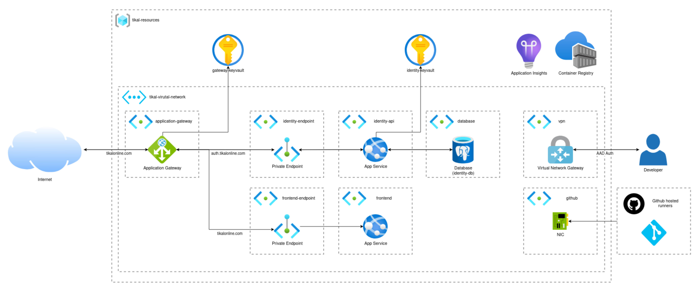

# Table of Contents
- [Summary](#summary)
- [Start Developing](#start-developing)
    - [Building From Scratch](#building-from-scratch)
- [Future Improvements](#future-improvements)

# Summary

The complete Infrastructure for this project is currenty deployed in the azure cloud using Terraform. There is only one (production) environment.

Here is a rough overview of the current architecture:

# Start Developing

- Install [Terraform](https://developer.hashicorp.com/terraform/install).

- Install the needed providers

<pre>
terraform init
</pre>

- Make sure to define all variables that are mentioned in "./variables.tf"

- Start planning and applying your changes

## Building From Scratch

When building up the infrastructure from scratch one manual step is needed. 

To authorize the vpn for Microsoft Entry ID Authentication, it needs to be registered. There are multiple way to do this. Here are instructions on how to do it manually:

- https://learn.microsoft.com/en-us/azure/vpn-gateway/openvpn-azure-ad-tenant

This operation will yield the needed "vpn_application_id" (see variables.tf).

# Future Improvements

A list of improvements that I'd like to make if money wasnt a thing:

TODO